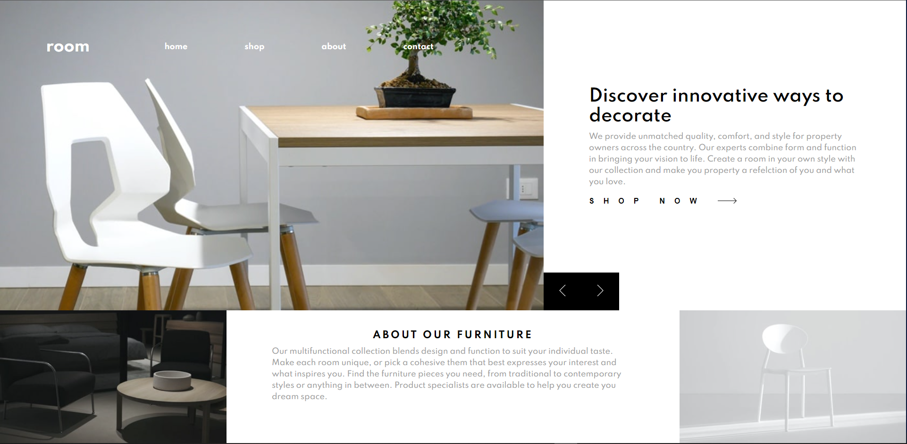
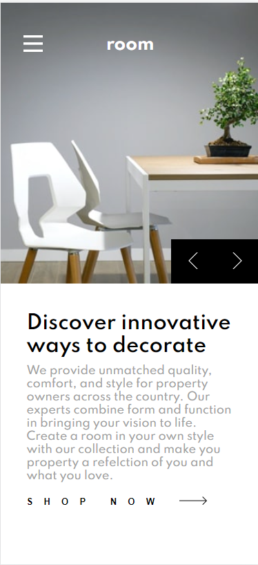
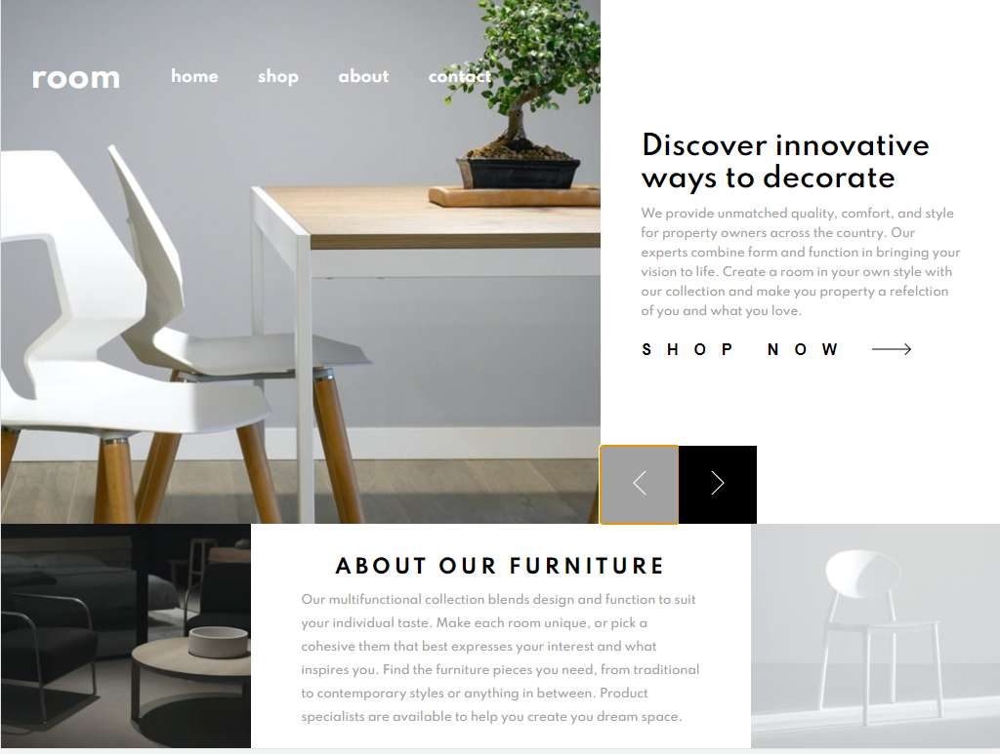

# Room-Homepage

challenge from front end mentor. Room Homepage.

link to project: https://naser23.github.io/Room-Homepage/

// SCREENSHOTS OF PROJECT //

// Desktop Version //

//////////////////////////////////////////////////////////////////////////////////////////////////////

// Mobile Version //

//////////////////////////////////////////////////////////////////////////////////////////////////////

// Tablet Version //

// OVERVIEW //

I built this with html/css/vanilla javascript.

1. I learned a lot about creating layouts and that most of the thought process comes before coding anything. i jumped in and started coding before thinking about the layout seriously and that got me later on. when i sat down and though about how i would build certain things and how something would work on both versions the time i spent actually typing code became much shorter.

2. i got a lot better at making mobile webistes. This is because i realized the breakpoints i was using with older projects was not detailed enough and didnt account for a lot of screens. With this project, I used these 2 sites to help me set up good breakpoints that would set me up for success for most screens: https://devfacts.com/media-queries-breakpoints-2021/, https://ricostacruz.com/til/css-media-query-breakpoints. i also used styling on certain screens to help the screen look better on said devices (ex: iphone 5/SE).

im really glad i decided to build this because I really got better than i was at building responsive web pages. its not perfect but im gonna try to build a couple more and shapren these 3 skills (html/css/vanilla javascript) before moving on to a framework.

this was created by Naser Abdulkadir: github: https://github.com/naser23 linkedIn: https://www.linkedin.com/in/naser-abdulkadir-38124015a/
